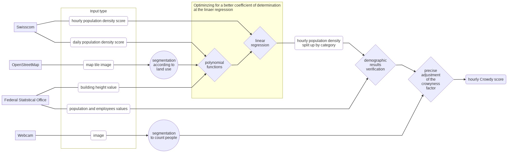

[![Contributors][contributors-shield]][contributors-url]
[![Forks][forks-shield]][forks-url]
[![Stargazers][stars-shield]][stars-url]
[![Issues][issues-shield]][issues-url]
[![MIT License][license-shield]][license-url]
[![LinkedIn][linkedin-shield]][linkedin-url]

# Crowdy-Data-Science
The goal of this challenge is to build a model that predicts the crowdedness in Switzerland. The unsupervised algorithm is based on data from Swisscom, OSM, and BFS.

## Table of Contents

* [About the Project](#about-the-project)
  * [Built With](#built-with)
* [Project Overview](#project-overview)
  * [First Part: Parsing data](#first-part-parsing-data)
  * [Second Part: Image segmentation](#second-part-image-segmentation)
  * [Third Part: Data Analysis](#third-part-data-analysis)
  * [future steps](#future-steps)
* [Roadmap](#roadmap)
* [Contributing](#contributing)

## About The Project
[Crowdy](crowdy-url) begun at the Hackathon VersusVirus May 2020. The aim is to avert accumulations of people and thus an increased risk of infection in advance.

We are thrilled that our group has already found some partners. In addition to MongoDB and emonitor, Swisscom is an essential partner. Our approach is to calculate larger gatherings of people in public space from the utilization of radio cells.

This repository shows the data mining part. It includes the download of the raw data and all processing steps to the final score of the people in public.

You can find more [Crowdy](crowdy-url) open code in the following repos:
* [App-Prototype made with Flutter](https://github.com/KatCe/Crowdless-flutter-Prototype)
* ...

### Built With
I developed 0the software in [JupyterLab 2.2.6](https://jupyter.org/) with [Python 3.8.5](https://www.python.org/)  managed by [Conda 4.8.4](https://docs.conda.io/en/latest/). For the production process, functions are outsourced to Python files. The visualization is still done with Jupiter Lab.

I will briefly name the important packages and their function in this project:
* `oauthlib.oauth2`, `requests_oauthlib` & `urllib.request`: For parsing data from Swisscom's API with authorization.
* [`OSMViz`](https://pypi.org/project/osmviz/): For load tiles from [OpenStreetMap](www.openstreetmap.org). Please read [Tile Usage Policy](https://operations.osmfoundation.org/policies/tiles/) and support the project.
* `JSON` & `GeoJSON`: To cache, store and transmit data within the project pipeline
* `matplotlib`: For creating graphs and plots of functions and numbers.
 * `mpl_toolkits.basemap`: For showing geodata on a static map in JupyterLab
* `folium`: For visualizing data geodata on a dynamic map and store it as a website.
* `pandas`: For analyzing and getting insights from datasets
* `PyTorch`: As my personal favorite deep learning framework
* [`detectron2`](https://github.com/facebookresearch/detectron2): For object detection on webcam images

## Project Overview

### First Part: Parsing data
The first part aims to parse data from the Swisscom, OSM, FSO(BFS) and the webcams.

### Second Part: Image segmentation
As part of the pipeline, it is necessary to extract the information from the images. It is much easier to work with different classes and their proportions in one image.
With OpenStreetMap data, it is sufficient to count the pixels by color. A complicated approach is required with webcam data and people counting, this is what I use state-of-the-art object detection algorithms.

### Third Part: Data Analysis
The third part is the major consolidation of the data sources Swisscom, OpenStreetMaps, and the Federal Statistical Office. Various techniques such as linear regression, and principal component analysis (PCA) and partial least squares (PLS) observe correlations to calculate the crowdedness

### Future Steps
As shown in the [overview graphic](#-project-overview), there is the option of verifying the calculated crowdedness and fine-tuning the data using the webcam output.

<!-- MARKDOWN LINKS & IMAGES -->
<!-- https://www.markdownguide.org/basic-syntax/#reference-style-links -->
[contributors-shield]: https://img.shields.io/github/contributors/Brieden/Crowdy-Data-Science.svg?style=flat-square
[contributors-url]: https://github.com/Brieden/Crowdy-Data-Science/graphs/contributors
[forks-shield]: https://img.shields.io/github/forks/Brieden/Crowdy-Data-Science.svg?style=flat-square
[forks-url]: https://github.com/Brieden/Crowdy-Data-Science/network/members
[stars-shield]: https://img.shields.io/github/stars/Brieden/Crowdy-Data-Science.svg?style=flat-square
[stars-url]: https://github.com/Brieden/Crowdy-Data-Science/stargazers
[issues-shield]: https://img.shields.io/github/issues/Brieden/Crowdy-Data-Science.svg?style=flat-square
[issues-url]: https://github.com/Brieden/Crowdy-Data-Science/issues
[license-shield]: https://img.shields.io/github/license/Brieden/Crowdy-Data-Science.svg?style=flat-square
[license-url]: https://github.com/Brieden/Crowdy-Data-Science/blob/master/LICENSE.txt
[linkedin-shield]: https://img.shields.io/badge/-LinkedIn-black.svg?style=flat-square&logo=linkedin&colorB=555
[linkedin-url]: https://www.linkedin.com/in/sven-brieden/
[crowdy-url]: http://www.crowdy.ch/
