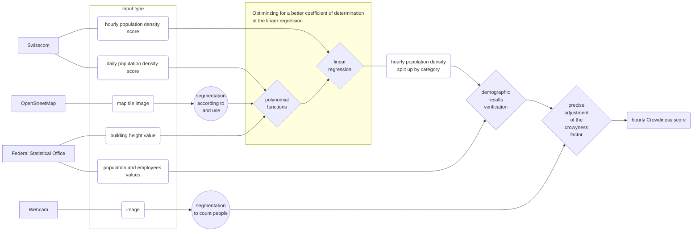

```mermaid
graph LR

%% Input source
%%subgraph box1 [ ]
%%style box1 fill:white, stroke-width:1px
Swiss[Swisscom]
Osm[OpenStreetMap]
Bfs[Federal Statistical Office] 
Webc[Webcam]
%%end

%% Input format
subgraph box1 [ Input type]
style box1 fill:white, typee-width:1px
lb1(hourly population density score)
lb2(daily population density score)
lb3(building height value)
lb4(population and employees values)
lb5(map tile image)
lb6(image)
style lb1 fill:white,stroke-width:1px
style lb2 fill:white,stroke-width:1px
style lb3 fill:white,stroke-width:1px
style lb4 fill:white,stroke-width:1px
style lb5 fill:white,stroke-width:1px
style lb6 fill:white,stroke-width:1px
end

%% first lines
Swiss---lb1
Swiss---lb2
Bfs---lb3
Bfs---lb4
Osm---lb5
Webc---lb6

%% Operators
ws((segmentation<br/>to count people))
s((segmentation<br/> according to<br/>land use))
p{polynomial<br/>functions}
l{linear<br/>regression}
d{demographic<br/>results<br/>verification}
c{precise<br/>adjustment<br/>of the<br/>crowyness<br/>factor}

lb5 --> s
lb6 --> ws

lb2 --> p
lb3 --> p
s --> p

lb7(hourly population density<br/>split up by category)
style lb7 fill:white,stroke-width:1px

subgraph box3 [<br/>Optiminzing for a better coefficient of determination<br/>at the linaer regression ]
p --> l
lb1 --> l
end


l --- lb7
lb7 --> d
lb4 --> d

d --> c
ws --> c
c --> fin(hourly Crowdiness score)
```
